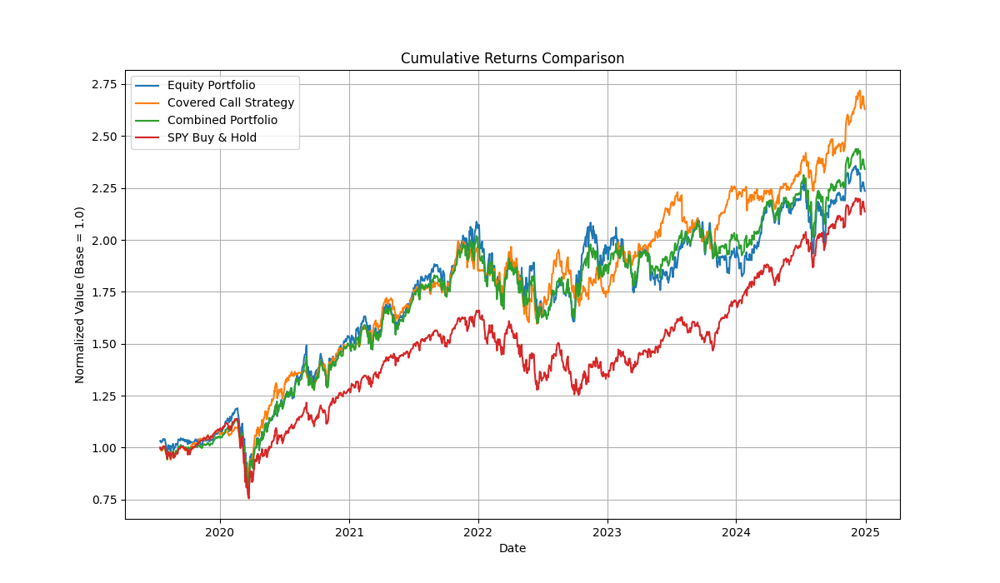

# Portfolio Investing Project

## Overview

This project explores a range of portfolio investing strategies by simulating and comparing different approaches, including:
- **Equity Portfolio Simulation:** Quarterly rebalancing using CAPM estimates and efficient frontier optimization upon 11 sector ETFs.
- **Covered Call Strategy:** A simulation that sells options on sector ETFs with dynamic, volatility‐driven parameters based on the Black-Scholes model.
- **Combined Portfolio Strategy:** A dynamic mix of the above approaches, weighted by market volatility.

The simulations use historical financial data and produce risk metrics and visualizations to help in assessing performance. Techniques such as bootstrap sensitivity analysis and differential evolution optimization (available as commented code) are also included to further refine the strategies.

## Directory Structure

Portfolio Investing/
├── notebooks/                                     # Notebooks for interactive analysis.
│   ├── Finance_Academy_Project.ipynb              # Main Jupyter Notebook for simulations.
│   ├── portfolio_risk_metrics.xlsx               # (Optional) Duplicate of risk metrics file.
│   └── output/                                    # Visualizations and outputs from notebook runs.
│       ├── cumulative_returns.png                # Cumulative returns plot.
│       ├── daily_returns_histogram.png           # Daily returns histogram.
│       ├── drawdown_curve.png                    # Drawdown curve plot.
│       ├── rolling_volatility.png                # Rolling volatility plot.
│       ├── rolling_sharpe_ratio.png              # Rolling Sharpe ratio plot.
│       ├── correlation_heatmap.png               # Correlation heatmap.
│       ├── bootstrap_sensitivity.png             # Bootstrap sensitivity distribution plot.    
└── scripts/                                       # Primary execution scripts.
    ├── portfolio.py                               # Main script for simulating strategies and computing risk metrics.
    ├── visuals.py                                 # Script for generating and saving visualizations.

## Requirements

- **Python 3.7+**

## Installation

1. **Clone the repository:**
   
   git clone <repository_url>
   cd Portfolio Investing
  
2. **Install dependencies:**

   > pip install -r requirements.txt

## Usage

### Running the Simulations

- **Main Script:**  
  To run the comprehensive portfolio simulations (equity, covered call, and combined strategies) and output risk metrics and visualizations, execute:
  
  python scripts/portfolio.py
  
  This will download historical data, run the simulations, and save several plots and an Excel file (`portfolio_risk_metrics.xlsx`) in the project’s output directory.

- **Jupyter Notebook:**  
  For an interactive experience and step-by-step analysis, open the notebook:
  
  jupyter notebook notebooks/Finance_Academy_Project.ipynb
  

### Key Configurations

The following parameters can be adjusted in the scripts to tailor the analysis:
- **Time Period:**  
  Set by `Start_Date` and `End_Date` (e.g., `"2019-06-01"` to `"2024-12-31"`).
- **Risk-Free Rates:**  
  Separate risk-free rates for equity (CAPM & Sharpe calculations) and options (Black-Scholes pricing).
- **Option Parameters:**  
  Configure shares per contract, transaction cost, target delta, option term lengths, and volatility thresholds.
- **ETF List & Benchmark:**  
  A list of sector ETFs (e.g., `['XLY', 'XLP', ...]`) and a benchmark (typically `SPY`) are used throughout the simulations.

### Visualizations and Outputs

The project generates various plots including:
- Cumulative returns comparisons.
- Histograms of daily returns.
- Drawdown curves.
- Rolling volatility and Sharpe ratios.
- Correlation heatmaps.
- Bootstrap sensitivity distributions.
- Sector weight distributions.

All generated images are saved in the `output/` subdirectories for both the notebooks and script executions.

## Project Details

### Simulation Components

- **Equity Portfolio Simulation:**  
  Uses historical price data and quarterly rebalancing strategies via CAPM, Monte Carlo simulation, and efficient frontier optimization (via PyPortfolioOpt).

- **Covered Call Strategy:**  
  Implements option selling using Black-Scholes pricing with dynamic strike selection, adjusting option terms based on current volatility.

- **Combined Strategy:**  
  Integrates both the equity and covered call strategies using a dynamic equity weighting based on SPY’s volatility.

### Risk Metrics Analysis

For each strategy, the following metrics are computed:
- **Cumulative Return**
- **Annualized Return**
- **Annualized Volatility**
- **Sharpe Ratio**
- **Maximum Drawdown**

A bootstrap sensitivity analysis is also performed to measure the robustness of these metrics.

### Optimization (Optional)

There is code commented out in `scripts/portfolio.py` for optimization (via differential evolution) of strategy parameters. This can be enabled if parameter optimization is desired.

## Contributing

Contributions to improve the simulations, add new features, or enhance documentation are welcome. Please fork the repository and submit pull requests or open issues for discussion.

## License

*Include your license information here (e.g., MIT License, Apache 2.0, etc.)*

## Acknowledgments

- Credit to the developers and maintainers of libraries such as [yfinance](https://github.com/ranaroussi/yfinance), [PyPortfolioOpt](https://github.com/robertmartin8/PyPortfolioOpt), and other essential Python libraries.
- Inspiration from finance research projects and academic resources.

## Contact

For questions or feedback, please contact:
- **Your Name / Organization**
- **Email:** [your.email@example.com]
- **GitHub:** [https://github.com/yourusername](https://github.com/yourusername)
