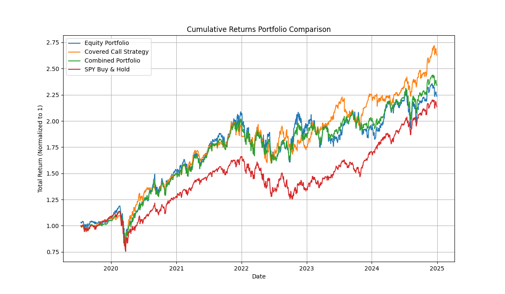

# Portfolio Investing Project

## Overview

This project explores a range of portfolio investing strategies by simulating and comparing different approaches, including:
- **Equity Portfolio Simulation:** Quarterly rebalancing using CAPM estimates and efficient frontier optimization upon 11 sector ETFs.
- **Covered Call Strategy:** A simulation that sells options on sector ETFs with dynamic, volatility‐driven parameters based on the Black-Scholes model.
- **Combined Portfolio Strategy:** A dynamic mix of the above approaches, weighted by market volatility.

The simulations use historical financial data and produce risk metrics and visualizations to help in assessing performance. Techniques such as bootstrap sensitivity analysis and differential evolution optimization (available as commented code) are also included to further refine the strategies.

## Requirements

- **Python 3.7+**

## Installation

1. **Clone the repository:**
   
   git clone [<repository_url>](https://github.com/RyLoveQuantStats/Portfolio-Investing.git)
  
2. **Install dependencies:**

   > pip install -r requirements.txt

## Usage

### Running the Simulations

- **Jupyter Notebook:**  
  For an interactive experience and step-by-step analysis, open the notebook:
  
  jupyter notebook notebooks/Finance_Academy_Project.ipynb

### Visualizations and Outputs

The project generates various plots including:
- Cumulative returns comparisons.
- Histograms of daily returns.
- Drawdown curves.
- Rolling volatility and Sharpe ratios.
- Correlation heatmaps.
- Bootstrap sensitivity distributions.
- Sector weight distributions.

All generated images are saved in the `output/` subdirectory of the notebooks folder.

## Project Details

### Simulation Components

- **Equity Portfolio Simulation:**  
  Uses historical price data and quarterly rebalancing strategies via CAPM, Monte Carlo simulation, and efficient frontier optimization.

- **Covered Call Strategy:**  
  Implements option selling using Black-Scholes pricing with dynamic strike selection, adjusting option terms based on current volatility.

- **Combined Strategy:**  
  Integrates both the equity and covered call strategies using a dynamic equity weighting based on SPY’s volatility.

### Risk Metrics Analysis

For each strategy, the following metrics are computed:
- **Cumulative Return**
- **Annualized Return**
- **Annualized Volatility**
- **Sharpe Ratio**
- **Maximum Drawdown**

## 📈 Portfolio Risk Metrics Summary

| Strategy              | Cumulative Return (%) | Annualized Return (%) | Annualized Volatility (%) | Sharpe Ratio | Max Drawdown (%) |
|-----------------------|------------------------|------------------------|----------------------------|--------------|------------------|
| Equity Portfolio      | 116.55                 | 14.64                  | 24.71                      | 0.51         | -32.61           |
| Covered Call Strategy | 162.87                 | 18.64                  | 18.08                      | 0.92         | -20.61           |
| Combined Portfolio    | 134.06                 | 16.23                  | 21.35                      | 0.67         | -28.97           |
| SPY Buy & Hold        | 113.66                 | 14.37                  | 20.07                      | 0.62         | -33.72           |

A bootstrap sensitivity analysis is also performed to measure the robustness of these metrics.
